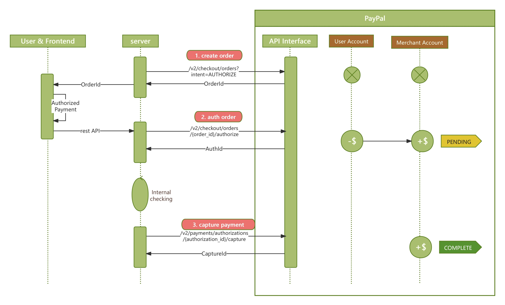
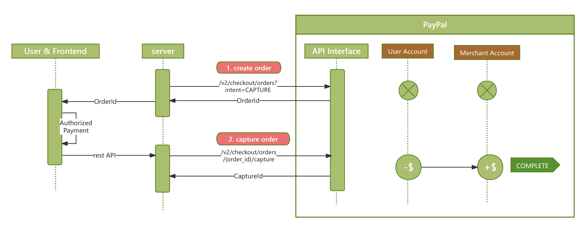

[](https://github.com/yeastgrow/paypal-springboot-demo/blob/master/README.md)
[](https://github.com/yeastgrow/paypal-springboot-demo/blob/master/README.zh.md)

## 1. Overview
- This project serves two main purposes:

  - **Cataloging Payment APIs**: We aim to categorize and elucidate the logic behind mainstream payment APIs. 
  - **Sandbox for Testing**: It functions as a sandbox environment where different scenarios and issues can be tested and experimented with.

- Tech Stack
  - Backend: Developed and maintained using Spring Boot, a powerful framework for building web applications. 
  - Frontend: Utilizes React for building a dynamic and responsive UI. For reference, check out this [React PayPal Demo](https://github.com/yeastgrow/paypal-react-demo).

- PayPal API Integrations:
  The project integrates several core PayPal APIs to facilitate a wide range of payment operations:
  1. Orders and Payments: Manage orders and process payments efficiently. 
  2. Subscriptions: Handle recurring payments with ease. 
  3. Invoices: Create and send invoices to customers. 
  4. Disputes: Address and manage disputes that may arise.

---
## 2. Using Sandbox

- Sign up for a PayPal developer account at [PayPal Developer Dashboard](https://developer.paypal.com/dashboard/accounts/).
- Each developer account comes with two default testing accounts, one personal testing account (for simulating the payer's behavior) and one business account (for simulating the merchant's behavior).
  - Developer Account -> Testing Tool -> Sandbox Account
    - Personal: Name, Phone, Country, Account ID, Email, Password
    - Business: Client ID, Secret, Name, Phone, Country, Account ID, Email, Password
- During the programming testing process, you can log in to the sandbox test account to view the account dashboard and the amount of money in the account at [Sandbox Dashboard](https://www.sandbox.paypal.com/mep/dashboard).
- Each sandbox account starts with an initial amount of $5000.

---
## 3. Getting Started

Follow these steps to set up and run the Payment Gateway API Sandbox project on your local machine.

### Prerequisites

- Ensure you have Java and Maven installed for the backend.
- Node.js and npm are required for the frontend.

### Backend Setup

1. **Clone the Repository**:
   ```bash
   git clone https://github.com/yeastgrow/paypal-springboot-demo.git
   ```

2. **Configure PayPal API Credentials**:
  - Obtain your `client id` and `client secret` from your PayPal Business account sandbox.
  - Open `src/main/resources/application.yml` and update the PayPal client credentials:
    ```yaml
    paypal:
      client:
        id: YOUR_CLIENT_ID
        secret: YOUR_CLIENT_SECRET
    ```

3. **Build and Run the Backend**:
  - Use Maven to build the project.
  - Run the Spring Boot application. By default, it will be accessible on `http://localhost:8080`.

### Frontend Setup 

Checkout this [repo](https://github.com/yeastgrow/paypal-react-demo), the specific steps of configuring and running the frontend are detailed there.

### Running the Project

- Once both the backend and frontend are running, you can access the frontend on the React development server's URL, which will interact with the backend running on port 8080.

### Testing

- Use the provided test scenarios to verify the functionality of the payment APIs.

--- 
## 3. Process Flow Outline

### 3.1 Order + Payment Process

- The `Order + Payment API` is often used for one-time payment scenarios such as shopping and home services.
- First, use the `Order API` to create an order, specifying the content and amount of the goods or services in the order.
- Then use the `Payment API` to pay for the order. For different payment scenarios, merchants can choose between two payment processes:
  - Option 1 - Auth then Capture in steps: 
    - User authorizes payment -> 
    - Merchant authorizes payment -> 
    - Merchant confirms the deliverable status of the order -> 
    - Merchant captures payment
  - Option 2 - Direct Capture: 
    - User authorizes payment -> 
    - Merchant captures order payment

- The process details are presented in three parts below.
  - 1. Front-end Process. The interaction process between the user, the PayPal payment button component, and the PayPal payment pop-up page.
         
  - 2. Back-end Process, Authorization and Capture in steps.
       
  - 3. Back-end Process, Direct Capture.
       

### 3.2 Subscriptions

### 3.3 Invoices

### 3.4 Disputes


