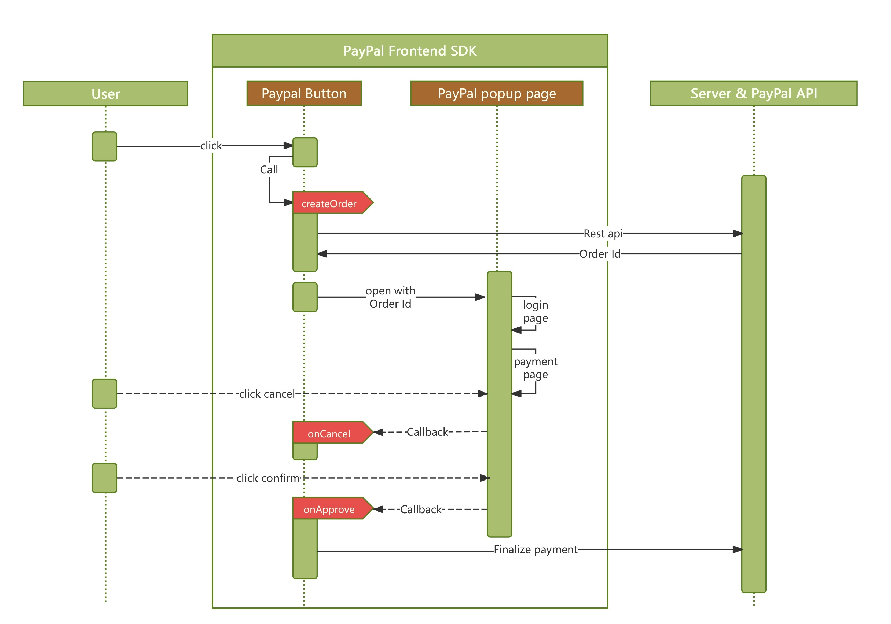
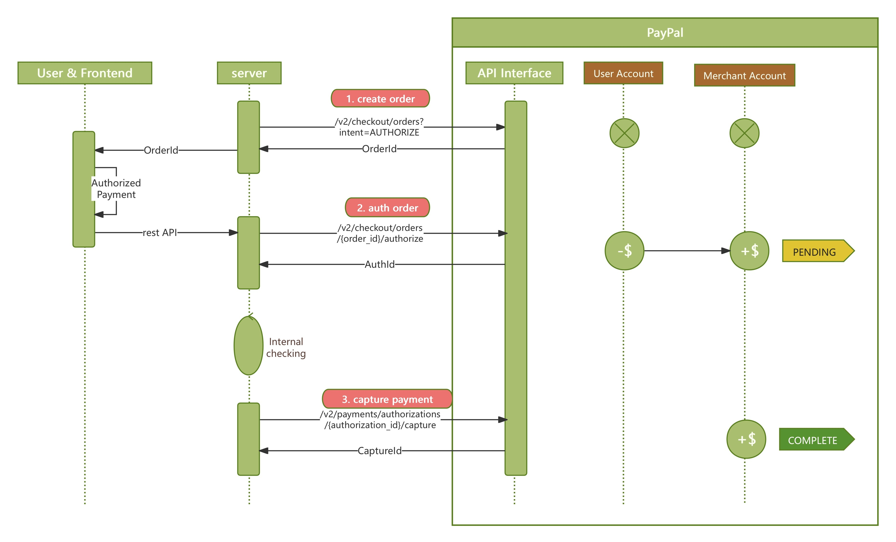
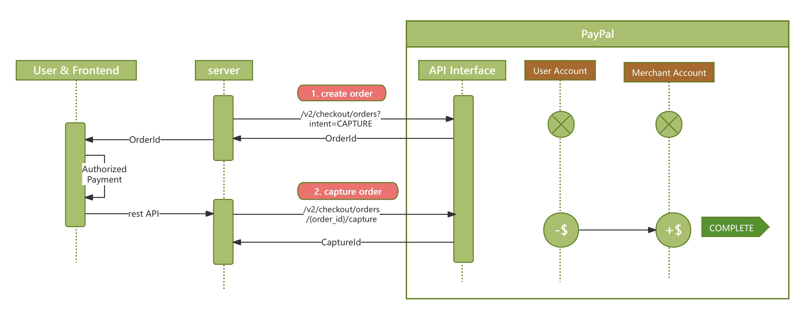

# 1. 大致介绍
_- 该项目有两个目的
  - 目的 1：归纳主流支付api类型和使用逻辑的梳理。
  - 目的 2：用作 sandbox，对不同的场景和问题进行测试
- 项目分为前后端，后端使用sprint-boot维护，前端使用react [code](https://github.com/yeastgrow/paypal-react-demo)。
- 主要会涉及的 paypal API
1. order + payment
2. Subscriptions
3. Invoices
4. Disputes_

# 2. 使用 Sandbox
 
- 开通 PayPal developer 的一个 account [link](https://developer.paypal.com/dashboard/accounts/) 
- 每个 developer 账号下面会默认给两个测试账号，一个是个人测试账号（用于模仿付款方行为），一个是企业账号（用于模仿商户行为）
  - developer account -> testing tool -> sandbox account
    - personal: Name,Phone, Country, Account ID, email, ps
    - business: clientId, secret, Name,Phone, Country, Account ID, email, ps
- 在编程测试过程中可以登录 [sandbox](https://www.sandbox.paypal.com/mep/dashboard) 的测试账户查看账户面板和账户中的金额 
- 每个sandbox账号都有初始 5000刀的金额

# 3. 跑项目

- sandbox 中的 business account 下面会有 client id 和 client secret
- 将其填入 resources/application.yml - paypal.client.id, paypal.client.secret 中
- 本地跑项目端口默认 8080

# 3. 调用流程的梳理

## 3.1 Order + payment 流程

- order + payment api, 经常会用于类似于购物，上门服务等一次付款的场景。
- 需要先使用 order api 创建订单，订单里写明物品或者服务的内容和金额
- 然后再使用 payment api 对订单进行支付，对不同的付款场景，商家可以选择两种支付流程
  - 选择1 - auth和capture分步进行：用户authorize payment -> 商家 authorize payment -> 商家确认订单 deliverable 的状态 -> 商家 capture payment
  - 选择2 - 直接capture: 用户authorize payment -> 商家 capture order 支付
- 下面分为三部分呈现流程细节
  - 1. 前端流程。用户，paypal付款按键组件，paypal付款弹出页之间的交互流程
        
  - 2. 后端流程，auth和capture分步进行
       
  - 3. 后端流程，直接capture
       

## 3.2 Subscriptions
## 3.3 Invoices
## 3.4 Disputes

# TODO:
1. 如何避免重复下单